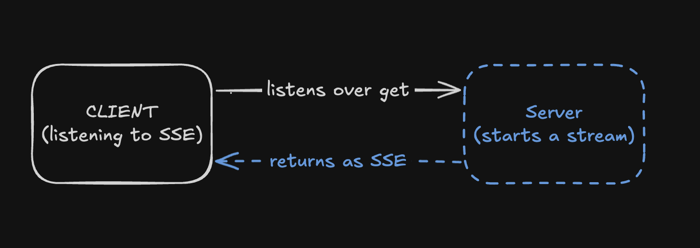

# Persisting Streams through Network Calls in Next.js

I was building an AI chatbot, I know I know the classic AI chatbot ... whatever. Well I have been building one, using vercel's AI SDK and I came across an interesting problem. Whenever I refresh the page, the chatbot loses the stream! "That's absurd", I said. Why wouldn't it persist ? Well turns out it does, just that I was missing some configurations. Yes, I was mostly two steps of configurations away from that juicy persistence.

Then I thought, how does this works ? How does the server know to keep sending data even when the connection is lost ? How does the client know to keep listening even when the connection is lost ? Well it turns out it's not that hard.

### SSE (Server Sent Events)

"Server Sent Events (SSE) is a simple way to send data from a server to a client. It's a one-way communication channel, meaning the server can send data to the client, but the client can't send data to the server. SSE is a great way to send data to the client in real-time. It's also a great way to send data to the client when the client is not actively requesting data. SSE is supported by all modern browsers."

The above is written by AI btw, ... yes this is README and I am writing in my IDE.

Anyways, SSE was the answer to my question. Create a stream -> return it as an SSE -> listen to it in the client side. That's it. Simple as that. Below is a simple diagram to understand the flow. I have missed one thing in the digram. The client needs to reconnect to the server when the connection is lost. You can use `useEffect` for it. But you get the idea.

Borderline, learn your SSE kids. It's actually very useful.
